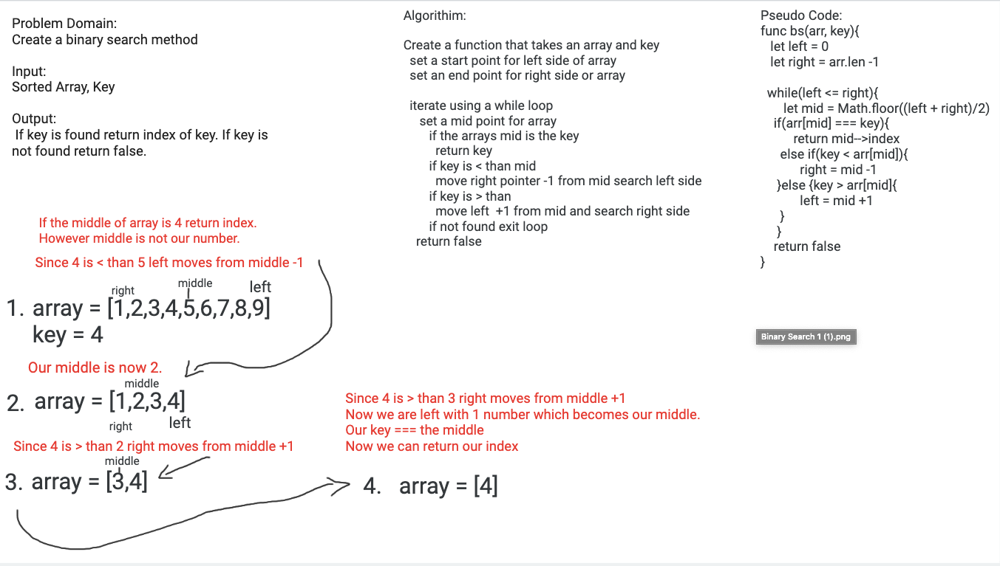

# Challenge Summary
Array Binary Search

## Challenge Description
Write a function called BinarySearch which takes in 2 parameters: a sorted array and the search key. 
If key is found return index of key. If key is not found return false.

## Approach & Efficiency
O(LogN)

## Solution

