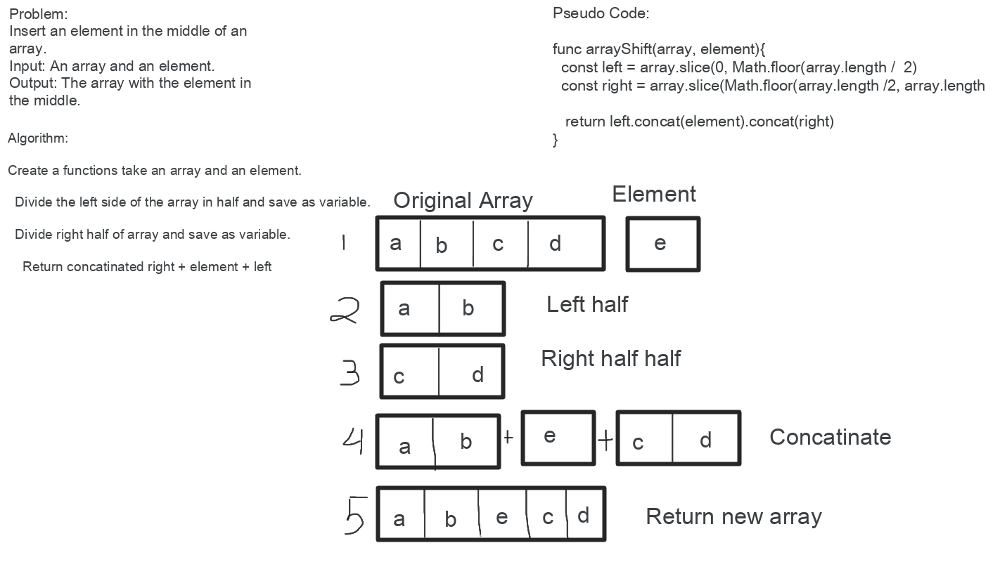

# Challenge Summary
Array Shift

## Challenge Description
Write a function that takes an array and an element. 
The function returns the array with the element inserted in the middle.

## Approach & Efficiency
Time & Space: O(n)

## Solution
