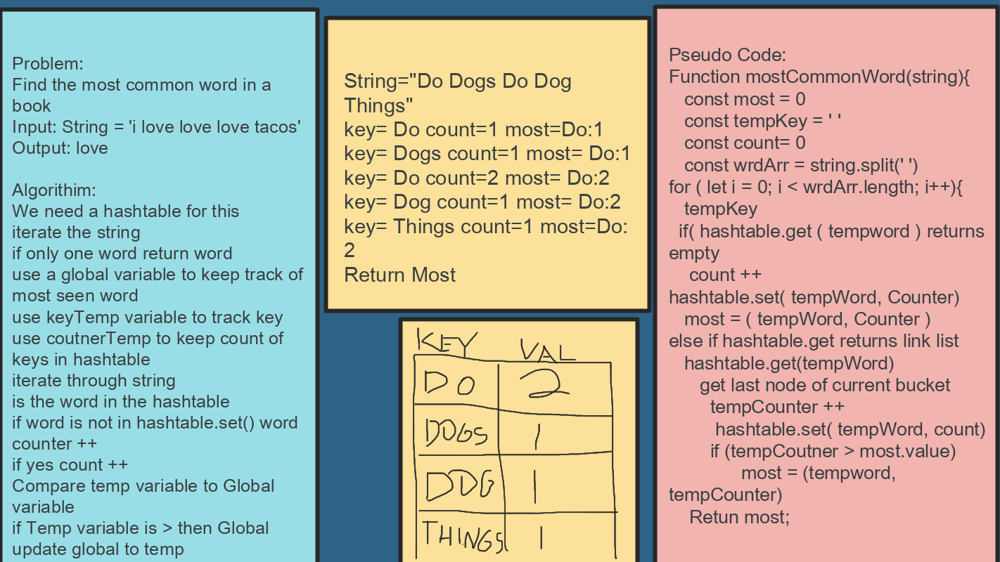

# Linked List

## Challenge Description 
Ask the candidate to write a function that determines the most common word in a book.

## Approach and Efficiency 
- Hash Table O(1)
- Input iteration O(n)
- Space O(n)
## Solution

