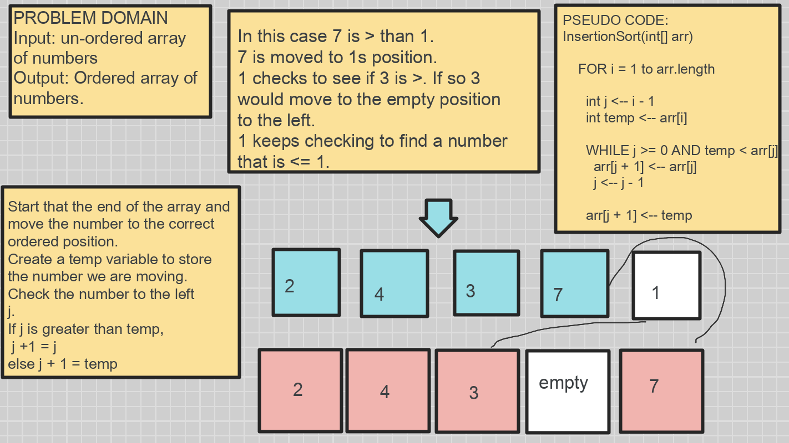

# Code Challenge Insertion Sort

## Challenge Summary
Review the pseudocode below, then trace the algorithm by stepping through the process with the provided sample array. Document your explanation by creating a blog article that shows the step-by-step output after each iteration through some sort of visual.


## Challenge Description
Explain insertionSort() in a blog.

## Approach & Efficiency
Best case O(n) if given a sorted array as input. 

Worst case is O(nˆ2) if given an unsorted array.


## Insertion Sort
This method takes in an array and builds a new sorted array one item at a time. At each iteration of an array, insertion sort removes one element from the input data, and finds the location it belongs to within the sorted list. It repeats until no input element remains. {wiki}

## Pseudo Code
```
sdf
  InsertionSort(int[] arr)
  
    FOR i = 1 to arr.length
    
      int j <-- i - 1
      int temp <-- arr[i]
      
      WHILE j >= 0 AND temp < arr[j]
        arr[j + 1] <-- arr[j]
        j <-- j - 1
        
      arr[j + 1] <-- temp
```


