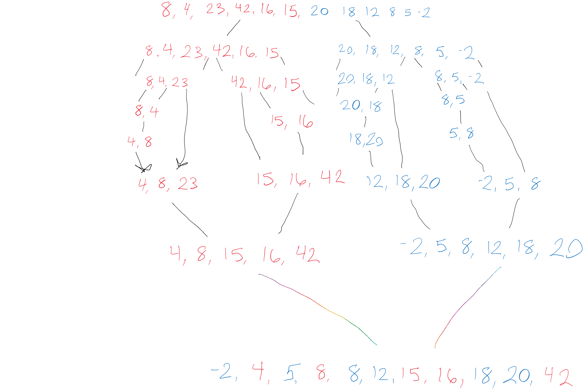

# Code Challenge: Merge Sort

```
Pseudo Code

ALGORITHM Mergesort(arr)
    DECLARE n <-- arr.length
           
    if n > 1
      DECLARE mid <-- n/2
      DECLARE left <-- arr[0...mid]
      DECLARE right <-- arr[mid...n]
      // sort the left side
      Mergesort(left)
      // sort the right side
      Mergesort(right)
      // merge the sorted left and right sides together
      Merge(left, right, arr)

ALGORITHM Merge(left, right, arr)
    DECLARE i <-- 0
    DECLARE j <-- 0
    DECLARE k <-- 0

    while i < left.length && j < right.length
        if left[i] <= right[j]
            arr[k] <-- left[i]
            i <-- i + 1
        else
            arr[k] <-- right[j]
            j <-- j + 1
            
        k <-- k + 1

    if i = left.length
       set remaining entries in arr to remaining values in right
    else
       set remaining entries in arr to remaining values in left
```

# Concept
**Merge Sort**

MergeSort takes two arrays as arguments. The two arrays will then be sorted and merged together to form a new sorted array.
1. We declare variables to store the value of each array. 
```
Ex: 
leftarray i = 0;
rightarray j = 0;
```

2. Next we declare a variable for an empty array. We will use this to merge and store
i and j.
```
arr = [];
```
3. Because this sort method is O(n) we can use a while loop to iterate through the arrays. We can do so with the following.
```
while i < left.length || j < right.length
This says while i or j are less than anything in the left array or the right array do the following.
```

4. Next we can make some checks.
```
if(i === left.length){
    arr.push(right[j])
    j++
}
This says if left is equal to the right, push the left to the right side.
```
5. The else if.
```
else if( j === right.length || left[i] <= right[j]){
    arr.push(left[i])
    i++
}
This checks if j matches the right array or if left array[i] is less than or equal to right array[j]. If this is true we can push hte left array at postion[i]

```

6. The else
```
If the previous checks are not true we can then push right array[j]
else{
    arr.push(right[j])
}

```
7. We can not return results.
```
return arr;

```



