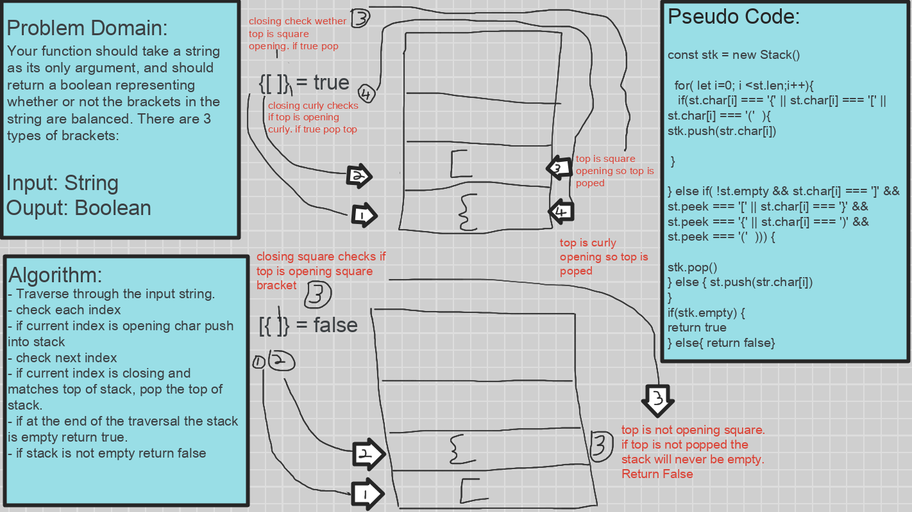

# Challenge Summary
Write a function ```Multi-bracket-validation()``` that validate whether a string of brackets is even. Meaning when there is an open bracket there must also be a closing bracket. Should take in an a string and return a boolean.
## Challenge Description
Your function should take a string as its only argument, and should return a boolean representing whether or not the brackets in the string are balanced. There are 3 types of brackets:
## Approach & Efficiency
O(n)

## Solution
